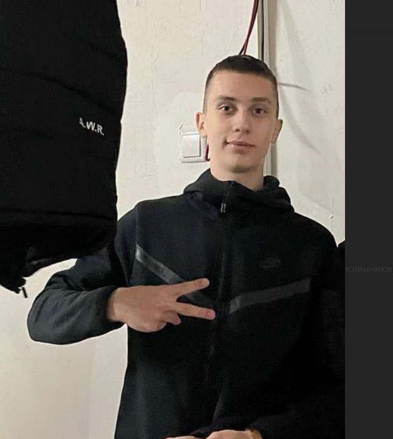

## 📋 Navigation

- [Alexandr Martsinovich](#alexandr-martsinovich)
- [About me](#about-me)
- [My skills](#my-skills)
- [My code](#my-code)
- [Work experience](#work-experience)

---


# Alexandr Martsinovich



## 📞 Contact

- 📱 +375(33)-36-68-268
- ✉️ Gmail: martinovich199@gmail.com
- 📷 [Instagram](https://www.instagram.com/zhuchkovva/)

---


## About me

> I'm Aunker, you remembor me? I programist

---

## My skills

💻 Programming languages & technologies:

- HTML
- C#
- XML

---

## My code

*(Section reserved for code samples)*
```csharp
if(int a=0; a!=4; a++){
    console.WriatLine("Эрнест какшка")
    ф++;} 
 if(int a=0; a!=4; a++){
    console.WriatLine("Эрнест какшка")
    ф++;} 
 
```

---

## Work experience

🔹 **Projects developed:**

- Создание онлайн-каталога SSD
- Написание программного кода для регистратуры поликлиники

🔹 **Education & Courses:**

- <u>1 курс обучения программной инженерии в БРУ</u>

🔹 **Languages:**

- <ins>Уровень английского: A1</ins>

---
